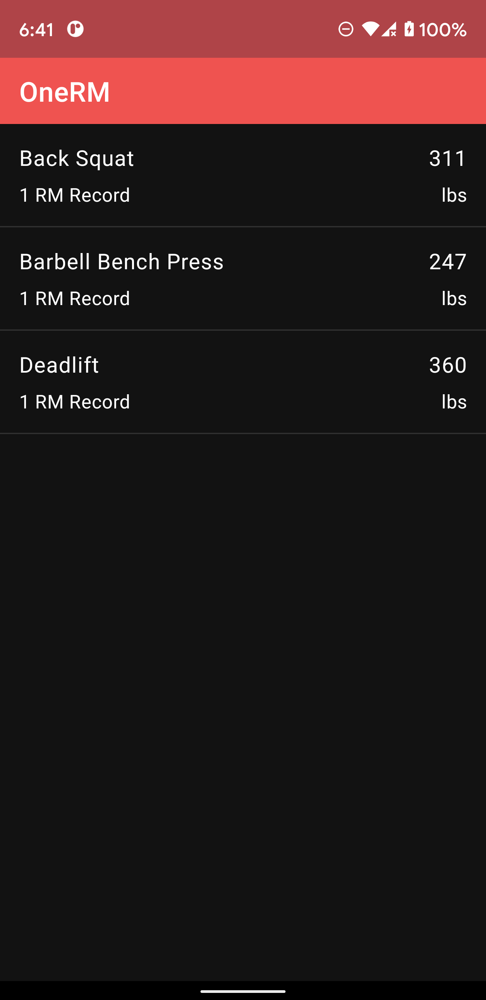
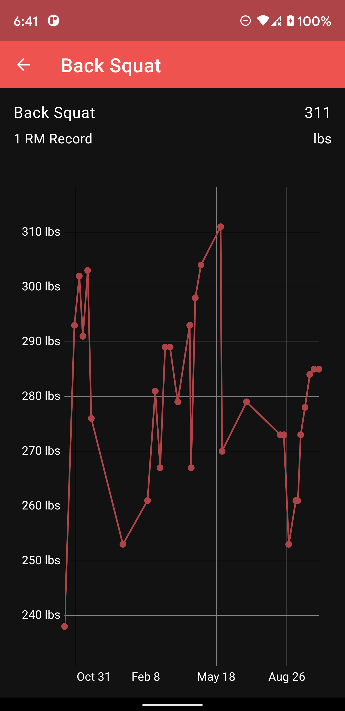

# OneRM
One rep max and charts

## Architecture & Dependencies
Project is written in Kotlin and follows MVVM clean architecture pattern with best practises and guidelines mentioned [here](https://developer.android.com/jetpack/guide)

Project utilizes Android Architecture Components and other libraries including: 
1. Hilt + Dagger - Dependency injection
2. Room - Local database storage
3. Coroutines & flow - Concurrency design pattern
4. Flow - Responsive data flow
5. Jetpack Navigation - Navigation between screens
6. View Bindings
7. Androidx RecyclerView + ListAdapter + DiffUtil - Create dynamic list, present list data in RecyclerView, computing diffs between Lists on a background thread
8. MPAndroidChart - Charting library for plotting points in chart view
9. Kotest Assertion - Test framework for kotlin
10. MocK - Mocking library for Kotlin
11. Androidx packages/dependencies

## Build app
Run `./gradlew clean assembleDebug` command from Android Studio's Terminal window.

## Input
Project uses workout history as a input file provided in assets folder [here](app/src/main/assets).
For simplicity, file data is loaded in local database storage using Room library implementation. This is one time operation and mass insert will occur one time only when creating a database (usually on first app launch after install).

Note- If you want to test app with different set of data, follow below steps
1. Update [workout-data](app/src/main/assets/workout-data.txt) or create new file in [assets](app/src/main/assets) folder.
2. Make sure file name matches `WORKOUT_DATA_FILE_NAME` located in [WorkoutHistoryCallback](app/src/main/java/me/fitbod/repetition/db/WorkoutHistoryCallback.kt)
3. Uninstall and install app

## Output

## Assumptions
- Maximum of OneRMs is used when displaying values on screen
- Workout history data file is always in English.
- exercise name is a unique string.
- `sets` value is always 1.
- `reps` and `weight` is always greater than 0 and `weight`'s default unit is lbs.
- Code is self explanatory and doesn't include comments in code.

## What's not included? (Future improvements)
- Project doesn't support configuration for weight unit (kg, lbs etc)
- Local database doesn't support choice of languages (default is English)
- Includes minimal support for theme, fonts and colors (light/dark)
- Project is monolithic (separated by packages) and allows easy migration to multi-module setup